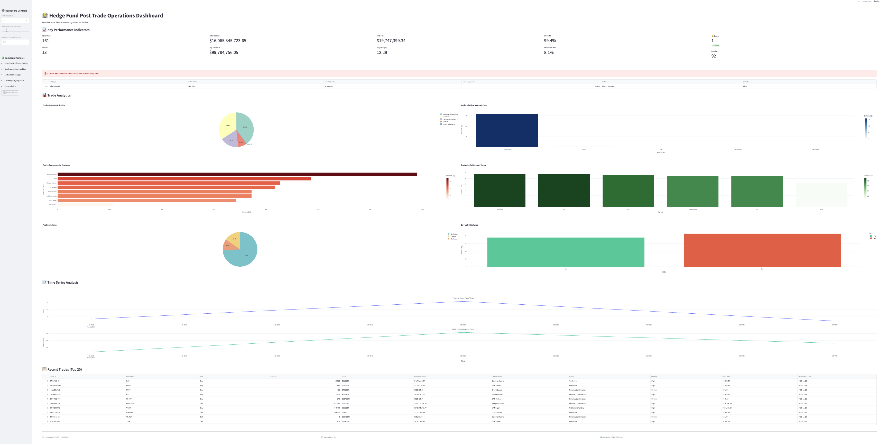
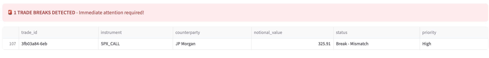
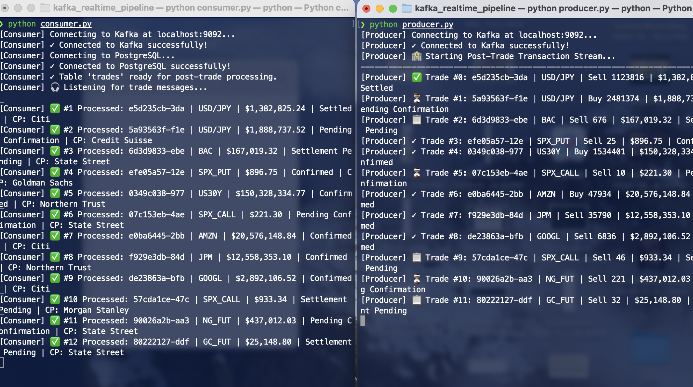
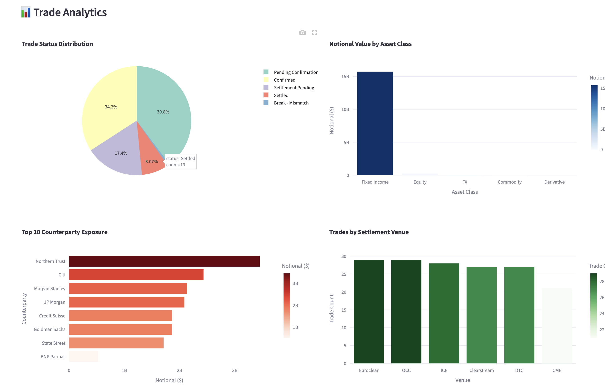

# Real-Time Post-Trade Streaming System

## Project Overview

This project implements a real-time data streaming pipeline for hedge fund post-trade operations. The system uses Apache Kafka to stream synthetic trade transactions, stores them in PostgreSQL, and visualizes the data through a live Streamlit dashboard.


## System Architecture

The pipeline follows a simple flow: synthetic trades are generated by a producer, streamed through Kafka, consumed and stored in PostgreSQL, then displayed on a real-time dashboard.

```
Producer.py → Kafka → Consumer.py → PostgreSQL → Dashboard.py
```

## What This System Does

The pipeline simulates post-trade operations at a hedge fund. After trades are executed, they go through a lifecycle of confirmation, settlement, and reconciliation. This system generates synthetic trades across multiple asset classes (equities, bonds, derivatives, FX, and commodities), processes them through Kafka, and provides real-time visibility into the trade pipeline.

## Live Dashboard

### Overview


The dashboard displays key metrics and charts that update every 5 seconds. Users can see total trades processed, notional value, fee breakdowns, and various analytical views of the trade flow.

### Real-Time Updates


As new trades flow through the system, the dashboard automatically updates. The KPI numbers increment, charts adjust to show new data, and the trade table displays the most recent transactions.

### Trade Break Detection


When trade exceptions occur (mismatches or missing trades), the system displays red alert boxes. These breaks require manual review by operations teams and are highlighted for immediate attention.

## Technical Implementation

### Data Model

Each trade contains 20 attributes covering trade details (ID, instrument, side, quantity, price), financial information (notional value, brokerage fees, clearing fees, exchange fees), settlement data (counterparty, venue, trade date, settlement date), and operational status (pending confirmation, confirmed, settlement pending, settled, or break).

### Producer Component

The producer generates 30-60 trades per minute across five asset classes. It creates realistic trade data including eight different counterparties like Goldman Sachs, JP Morgan, and Morgan Stanley. The system maintains a realistic 1-2% break rate to simulate real-world conditions.

### Consumer Component

The consumer reads messages from the Kafka topic "trades" and writes them to PostgreSQL. It processes approximately 60 trades per minute and handles duplicate messages gracefully through idempotent database operations.

### Dashboard Component

Built with Streamlit, the dashboard provides over 10 real-time visualizations. It automatically refreshes every 5 seconds and includes break detection alerts that notify users when exceptions occur.

## Running System


The system requires three terminal windows running concurrently. The first runs the consumer, the second runs the producer, and the third launches the Streamlit dashboard.

## Results



The system successfully demonstrates real-time data streaming through Kafka, structured data storage in PostgreSQL, interactive visualization with multiple chart types, automated exception detection, and counterparty exposure monitoring.

## Technology Stack

The project uses Kafka as the message broker for event streaming, PostgreSQL for relational data storage, Streamlit for the web dashboard interface, Docker for container orchestration, and Python for all application logic.
